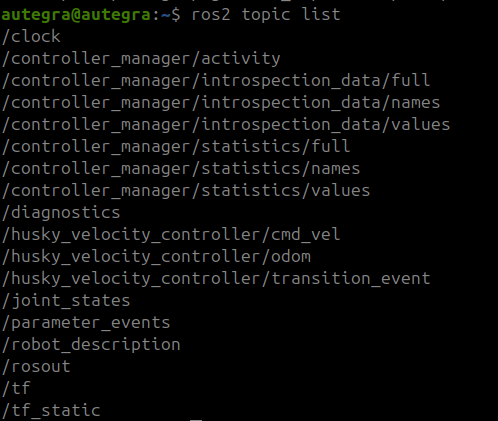
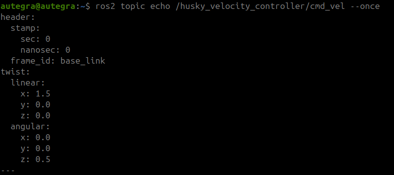

# Husky Mobile Robot with DiffDriveController in Gazebo Simulator (ROS2)

## 🎯 Goal
Launch a Husky mobile robot in Gazebo, simulate differential drive motion, and learn how to control the robot by publishing velocity commands from the terminal.

## 📚 Tutorial Level
Basics

---

## 📖 Overview

This project demonstrates how to simulate the Husky robot in Gazebo using a differential drive controller. The robot is equipped with a `DiffDriveController` that enables realistic wheeled locomotion based on velocity commands (`cmd_vel`). Users can control the robot manually from the terminal or via ROS2 teleoperation tools while observing its motion in Gazebo and RViz.

The Husky platform is widely used in research and industry for autonomous navigation, mapping, and mobile robotics experiments. This tutorial provides a foundation for working with mobile robot simulation, controller configuration, and ROS2 control integration.

By the end of this tutorial, you will understand:
- Differential drive control in ROS2
- Sending velocity commands to a simulated robot
- Integrating Gazebo with ROS2 control frameworks

---

## 🧠 Main ROS2 Concepts
The main ROS2 concepts and skills covered in this tutorial are:

### URDF Modeling (Unified Robot Description Format)
URDF is an XML format used to describe the physical configuration of robots, including links, joints, sensors, and their relationships. In this tutorial, you'll learn to define a pan-tilt camera system's geometry and kinematics using URDF, enabling accurate simulation and visualization in Rviz.

### Controller Configuration (ros2_control Framework)
The ros2_control framework provides a modular way to implement, configure, and manage robot controllers in both simulation and real hardware. You'll learn how to set up joint controllers, configure them via YAML, and manage them using the Controller Manager, which handles loading, starting, and stopping controllers.

### Gazebo Plugins
Gazebo plugins extend the simulation environment by adding sensors, actuators, and interfaces to ROS2. You'll use plugins such as gazebo_ros_camera to simulate an RGB camera and interface its data with ROS2 topics, enabling real-time visualization and interaction

### ROS2 Topics
Topics are the primary communication mechanism in ROS2, allowing nodes to publish and subscribe to streams of data such as joint states and camera images. You'll learn to interact with these topics to command joint positions and visualize sensor data.


### Note

These instructions are for modern **Gazebo (Harmonic)**, not Gazebo Classic.

---

## 💻 System Requirements

- OS: Ubuntu 24.04 
- ROS2: Jazzy 
- Gazebo: Harmonic 
- Python: 3.10+

---

## 📦 Dependencies

```bash
sudo apt install \
  ros-jazzy-xacro \
  ros-jazzy-controller-interface \
  ros-jazzy-controller-manager \
  ros-jazzy-ros2-control \
  ros-jazzy-ros2-controllers \
  ros-jazzy-gz-ros2-control \
  ros-jazzy-joint-state-publisher \
  ros-jazzy-joint-state-publisher-gui \
  ros-jazzy-joint-state-broadcaster \
  ros-jazzy-hardware-interface \
  ros-jazzy-joint-trajectory-controller \
  ros-jazzy-diff-drive-controller \
  ros-jazzy-robot-localization \
  ros-jazzy-interactive-marker-twist-server \
  ros-jazzy-twist-mux \
  ros-jazzy-gazebo-ros-pkgs \
  ros-jazzy-ros-gz-sim \
  ros-jazzy-ros-gz-bridge \
  ros-jazzy-tf-transformations
```
  
## Make the Workspace and Sourcing the Setup Script

To build your ROS2 workspace and set up your environment, follow these steps:

1. Create the workspace and src directory:

```
    mkdir -p ~/husky_ws/src
    cd ~/husky_ws/src
```

2. Clone your packages into src, not the workspace root:

```
    git clone git@github.com:kingston23/husky_ros2.git
```

3. Go back to the workspace root, build the workspace and source the setup script:

```
    cd ..
    colcon build
    source install/setup.bash
```

Run source the setup script in every new terminal before using your workspace or add workspace in ~/.bashrc.

### Note
   If you’re new to ROS2 workspaces or want a detailed step-by-step guide, see the official ROS2 tutorial: `Creating a workspace (ROS2 Documentation) <https://docs.ros.org/en/jazzy/Tutorials/Beginner-Client-Libraries/Creating-A-Workspace/Creating-A-Workspace.html>`__.

---

## Husky Description

Short descriptions for each custom package in Husky ROS2 project:

### husky_description
Contains the URDF files and 3D meshes that define the physical structure, joints, and visual appearance of the pan-tilt camera system for simulation and visualization.

### husky_bringup
Provides launch files that automate the startup of the robot description, controllers, and Gazebo simulation environment, making it easy to bring up the complete system with a single command.

### husky_control
Implements example ROS2 nodes or scripts for sending joint commands and demonstrating custom control logic for the pan and tilt movements of the camera system.

### husky_gazebo
Implements example ROS2 nodes or scripts for sending joint commands and demonstrating custom control logic for the pan and tilt movements of the camera system.

### husky_viz
Implements example ROS2 nodes or scripts for sending joint commands and demonstrating custom control logic for the pan and tilt movements of the camera system.


## Enabling Control with ros2_control

The joint_state_broadcaster is a special controller that publishes the current state of all robot joints (position, velocity, effort) as ROS messages (specifically, the joint_states topic). It reads the state interfaces from the hardware (via ros2_control) and broadcasts them, making the information available for visualization, logging, and other nodes in the system

To control Husky mobile robot in simulation (Gazebo), we use the `ros2_control` framework. This enables real-time joint control using controllers defined in both the URDF and external configuration files.


## Launch file 

This code is a ROS 2 launch file written in Python, designed to launch an older Husky robot model in Gazebo Sim using ROS 2

### Launch Example:
These are the basic ROS 2 launch tools used to define launch arguments, include other launch files, set paths and environment variables, and launch nodes:

```
   from launch import LaunchDescription
   from launch.actions import DeclareLaunchArgument, IncludeLaunchDescription
   from launch.launch_description_sources import PythonLaunchDescriptionSource
   from launch.substitutions import EnvironmentVariable, LaunchConfiguration, PathJoinSubstitution
   from launch_ros.actions import Node
   from launch_ros.substitutions import FindPackageShare
```

These allow you to customize your launch:
   1. rviz: whether to launch RViz (true/false)
   2. world: choose the Gazebo world to launch (warehouse by default)
   3. use_sim_time: toggle ROS simulation time usage (default true)

```
   ARGUMENTS = [
      DeclareLaunchArgument('rviz', default_value='false', choices=['true', 'false'], description='Start rviz.'),
      DeclareLaunchArgument('world', default_value='warehouse', description='Gazebo World'),
      DeclareLaunchArgument('use_sim_time', default_value='true', choices=['true', 'false'], description='use_sim_time')]
```

Fetches the installed path of the husky_gazebo package:

```
   pkg_clearpath_gz = get_package_share_directory('husky_gazebo')
```

Resolves paths to two important launch files:
   1. gz_sim.launch.py: likely launches Gazebo with simulation settings.
   2. gazebo.launch.py: likely spawns the Husky robot.

```
   gz_sim_launch = PathJoinSubstitution([pkg_clearpath_gz, 'launch', 'gz_sim.launch.py'])
   gazebo_launch = PathJoinSubstitution([FindPackageShare("husky_gazebo"), "launch", "gazebo.launch.py"])
```

Launches the Gazebo simulation (with optional world, rviz, and use_sim_time settings):

```
   gz_sim = IncludeLaunchDescription(
      PythonLaunchDescriptionSource([gz_sim_launch]),
      launch_arguments=[
         ('world', LaunchConfiguration('world')),
         ('rviz', LaunchConfiguration('rviz')),
         ('use_sim_time', LaunchConfiguration('use_sim_time')),
      ]
   )
```

Spawns the Husky robot into the Gazebo world:

```
   robot_spawn = IncludeLaunchDescription(
      PythonLaunchDescriptionSource([gazebo_launch]),
      launch_arguments=[
         ('world', LaunchConfiguration('world')),
         ('rviz', LaunchConfiguration('rviz')),
         ('use_sim_time', LaunchConfiguration('use_sim_time')),
      ]
   )
```

Launches a ROS <-> Gazebo bridge node to forward /tf messages between the two ecosystems using ros_gz_bridge:

```
   bridge = Node(
      executable='parameter_bridge',
      package='ros_gz_bridge',
      arguments=[
         "/tf@tf2_msgs/msg/TFMessage@gz.msgs.Pose_V",               
      ],
      output="screen",
   )
```

This constructs the complete launch description and returns it to ROS2:

```
   ld = LaunchDescription(ARGUMENTS)
   ld.add_action(gz_sim)
   ld.add_action(bridge)
   ld.add_action(robot_spawn)
   return ld
```
   

## Controller Configuration (YAML)


The actual controllers are defined in a `control.yaml` file located in the `husky_control/config/` directory. We use one `DiffDriveController`.

**control.yaml:**

```
   controller_manager:
   ros__parameters:
      update_rate: 50 # Hz
      use_sim_time: False

      joint_state_broadcaster:
         type: joint_state_broadcaster/JointStateBroadcaster

      husky_velocity_controller:
         type: diff_drive_controller/DiffDriveController

   husky_velocity_controller:
   ros__parameters:
      use_sim_time: False
      left_wheel_names: ["front_left_wheel_joint", "rear_left_wheel_joint"]
      right_wheel_names: ["front_right_wheel_joint", "rear_right_wheel_joint"]

      wheel_separation: 0.512 #0.1  # 0.256  # 0.512
      wheels_per_side: 1 # actually 2, but both are controlled by 1 signal
      wheel_radius: 0.1651 # 0.015

      wheel_separation_multiplier: 1.875 # default: 1.0
      left_wheel_radius_multiplier: 1.0
      right_wheel_radius_multiplier: 1.0

      publish_rate: 50.0
      odom_frame_id: odom
      base_frame_id: base_link
      pose_covariance_diagonal: [0.001, 0.001, 0.001, 0.001, 0.001, 0.03]
      twist_covariance_diagonal: [0.001, 0.001, 0.001, 0.001, 0.001, 0.03]

      open_loop: false
      # Odometry fused with IMU is published by robot_localization, so
      # no need to publish a TF based on encoders alone.
      enable_odom_tf: false

      cmd_vel_timeout: 0.25
      #publish_limited_velocity: true
      use_stamped_vel: false
      velocity_rolling_window_size: 2

      # Preserve turning radius when limiting speed/acceleration/jerk
      preserve_turning_radius: true

      # Publish limited velocity
      publish_cmd: true

      # Publish wheel data
      publish_wheel_data: true

      # Velocity and acceleration limits
      # Whenever a min_* is unspecified, default to -max_*
      linear.x.has_velocity_limits: true
      linear.x.has_acceleration_limits: true
      linear.x.has_jerk_limits: false
      linear.x.max_velocity: 1.0
      linear.x.min_velocity: -1.0
      linear.x.max_acceleration: 3.00
      linear.x.max_jerk: 0.0
      linear.x.min_jerk: 0.0

      angular.z.has_velocity_limits: true
      angular.z.has_acceleration_limits: true
      angular.z.has_jerk_limits: false
      angular.z.max_velocity: 2.0
      angular.z.min_velocity: -2.0
      angular.z.max_acceleration: 6.0
      angular.z.min_acceleration: -6.0
      angular.z.max_jerk: 0.0
      angular.z.min_jerk: 0.0
```

## Launching the Controllers

To start the controllers when launching the simulation, we use the `controller_manager` spawner node. This is typically done inside your `gazebo.launch.py` launch file.

**Launch Snippet (Python):**

```
   # Directory Setup
   pkg_clearpath_gz = get_package_share_directory('husky_gazebo')
   gps_wpf_dir = get_package_share_directory('husky_control')
   params_dir = os.path.join(gps_wpf_dir, "config")
   launch_dir = os.path.join(gps_wpf_dir, 'launch')

   #  Set GZ_SIM_RESOURCE_PATH
   gz_resource_path = SetEnvironmentVariable(name='GZ_SIM_RESOURCE_PATH', value=[
      os.path.join(pkg_clearpath_gz, 'worlds'), ':',
      str(Path(get_package_share_directory('husky_description')).parent.resolve())
   ])

   #  Load Parameters
   world_path = LaunchConfiguration('world_path')
   prefix = LaunchConfiguration('prefix')  

   #  URDF & robot_description
   robot_description_content = Command([
      PathJoinSubstitution([FindExecutable(name="xacro")]),
      " ",
      PathJoinSubstitution([FindPackageShare("husky_description"), "urdf", "husky.urdf.xacro"]),
      " name:=husky prefix:='' is_sim:=true gazebo_controllers:=",
      config_husky_velocity_controller,
   ])
   robot_description = {"robot_description": robot_description_content}

   #  Set robot_state_publisher
   node_robot_state_publisher = Node(
      package="robot_state_publisher",
      executable="robot_state_publisher",
      output="screen",
      parameters=[{'use_sim_time': True}, robot_description],
   )

   #  Joint State Broadcaster - Launches a controller that publishes joint states (needed for visualization and TF).
   spawn_joint_state_broadcaster = Node(
      package='controller_manager',
      executable='spawner',
      arguments=['joint_state_broadcaster', '-c', '/controller_manager'],
      output='screen',
   )
   # Husky Velocity Controller - Starts the differential drive controller that controls Husky’s movement via /cmd_vel.
   spawn_husky_velocity_controller = Node(
    package='controller_manager',
    executable='spawner',
    arguments=['husky_velocity_controller', '-c', '/controller_manager'],
    output='screen',
   )

    # Make sure spawn_husky_velocity_controller starts after spawn_joint_state_broadcaster
    diffdrive_controller_spawn_callback = RegisterEventHandler(
        event_handler=OnProcessExit(
            target_action=spawn_joint_state_broadcaster,
            on_exit=[spawn_husky_velocity_controller],
        )
    )

    # Spawn the Robot in Gazebo
    diffdrive_controller_spawn_callback = RegisterEventHandler(
        event_handler=OnProcessExit(
            target_action=spawn_joint_state_broadcaster,
            on_exit=[spawn_husky_velocity_controller],
        )
    )

    # Launch robot_localization
   launch_husky_control = IncludeLaunchDescription(
      PythonLaunchDescriptionSource(PathJoinSubstitution([
         FindPackageShare("husky_control"), 'launch', 'control.launch.py'
      ]))
   )
```

It is essential that the `JointStateBroadcaster` is fully started before the pan and tilt controllers. This is done using an event handler that triggers after the `spawn_joint_state_broadcaster` completes:


## Publish velocity to topic

Gazebo camera plugin details


How to see the feed:
```
 ros2 run rqt_image_view rqt_image_view
```

List topics: 
```
ros2 topic list
```
See how format of messages on /cmd_vel topic:
```
ros2 topic info /husky_velocity_controller/cmd_vel
```
You should see this:
```
Type: geometry_msgs/msg/TwistStamped
Publisher count: 1
Subscription count: 1
```

### Twist to TwistStamped


If cmd_vel topic has msg type `TwistStamped` you need to convert Twist to `TwistStamped` like this:

```
   import rclpy
   from rclpy.node import Node
   from geometry_msgs.msg import Twist, TwistStamped

   # Defines a node class that inherits from rclpy.node.Node.
   class TwistToTwistStamped(Node):
      def __init__(self):
         super().__init__('twist_to_twist_stamped') # Initializes the node with the name twist_to_twist_stamped.
   
         # Creates a publisher that sends messages of type TwistStamped to the topic where 10 is the queue size for outgoing messages.
         self.publisher_ = self.create_publisher(TwistStamped, 'husky_velocity_controller/cmd_vel', 10)

         # Subscribes to the topic cmd_vel, which typically provides velocity commands as Twist messages. The callback self.callback will be called when a message is received.
         self.subscription = self.create_subscription(
               Twist,
               'cmd_vel',
               self.callback,
               10
         )
      # his function is triggered whenever a Twist message is received.
      def callback(self, msg):
         twist_stamped = TwistStamped()
         twist_stamped.header.stamp = self.get_clock().now().to_msg() # sets the current ROS 2 time.
         twist_stamped.header.frame_id = 'base_link'  # Set frame id
         twist_stamped.twist = msg # copies the original Twist message.
         self.publisher_.publish(twist_stamped) # Publishe the new TwistStamped message to the husky_velocity_controller/cmd_vel topic.

   # Main Function - Initializes the ROS2 Python system.
   def main(args=None):
      rclpy.init(args=args)
      node = TwistToTwistStamped()
      rclpy.spin(node)
      node.destroy_node()
      rclpy.shutdown()

   if __name__ == '__main__':
      main()
```

## Testing the System 

Launch example in **terminal 1**:

```
   ros2 launch husky_gazebo husky.launch.py 
```

Launch keyboard control in **terminal 2**:
```
   cd husky_withoutSensors_ws/src/husky_gazebo/launch
   python3 twistToTwistStamped.py 
```

Gazebo visualization:


Open a new terminal and write to control Husky with keyboard:

```
    ros2 run teleop_twist_keyboard teleop_twist_keyboard 
```

List all topics with ros2 topic list:



Open a new terminal and write to check husky_velocity_controller assigning velocity:

```
ros2 topic pub /husky_velocity_controller/cmd_vel geometry_msgs/msg/TwistStamped "{ header: { stamp: {sec: 0, nanosec: 0}, frame_id: 'base_link' }, twist: { linear: {x: 1.5, y: 0.0, z: 0.0}, angular: {x: 0.0, y: 0.0, z: 0.5} } }" --rate 10
```

See if msg is published on topic:


Husky should move in circle like this:
[Husky Demo](fig/husky_indoor_circle.mp4)

---

## Further Resources

Once Gazebo is installed and is all clear on the last quick test, you can move to the `Gazebo tutorials <https://gazebosim.org/docs/harmonic/tutorials>`__ to try out building your own robot!

If you use a different version of Gazebo than the recommended version, make sure to use the dropdown to select the correct version of documentation.

## Summary

In this tutorial, you have installed Gazebo and set-up your workspace to start with the `Gazebo tutorials <https://gazebosim.org/docs/harmonic/tutorials>`__.
